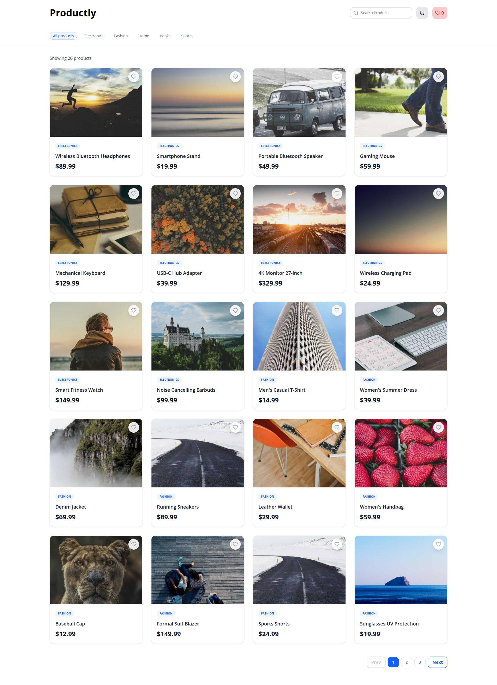
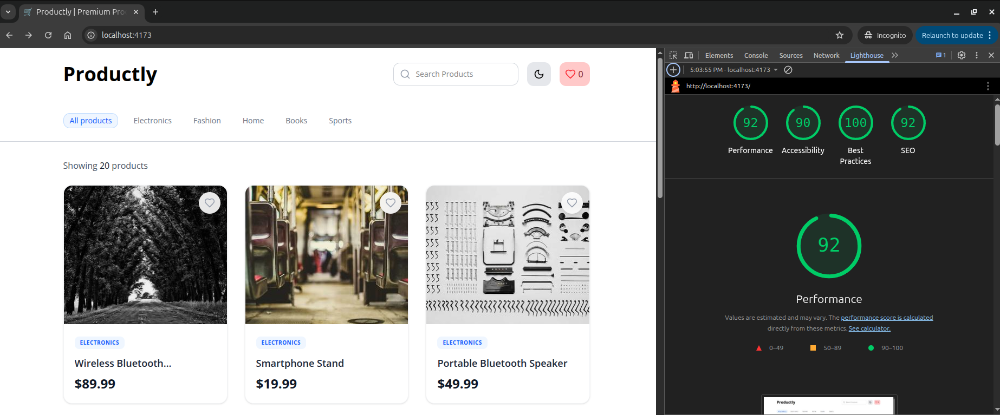
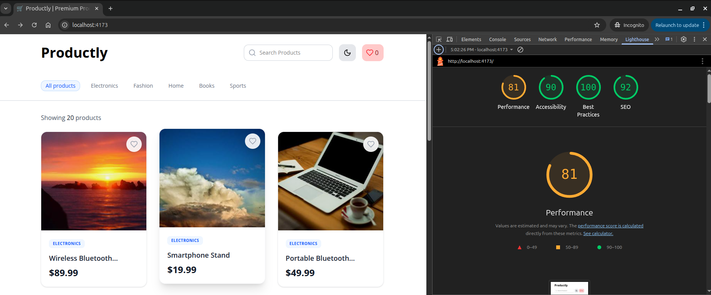

# Productly

Productly is a modern, high-performance product showcase platform built with React and Vite. It features a clean, responsive design optimized for both speed and user experience.

**[Live Demo](https://productly-opal.vercel.app/)**

---

## 🖥️ Project Preview



## 📋 Project Overview

Productly is designed to offer a seamless browsing experience for users looking for various products. The platform is built using React 19, Vite, and Tailwind CSS, ensuring a modern development workflow and a highly responsive interface. 

> [!NOTE]
> All product images and names used in this project are dummy data sourced from [Picsum](https://picsum.photos/).

## 🚀 Performance & Best Practices

We've prioritized performance and accessibility to ensure the best possible experience for all users. The project achieves excellent scores across all Lighthouse metrics.

### Lighthouse Results

| Desktop | Mobile |
| :---: | :---: |
|  |  |

### Key Improvements

- **Performance**: Leveraged Vite's fast build times and localized asset management. CSS is optimized via Tailwind CSS, and images are handled to minimize layout shifts.
- **Accessibility (a11y)**: Semantic HTML tags (`<header>`, `<main>`, `<section>`, etc.) and proper ARIA labels ensure the site is navigable via screen readers.
- **SEO**: Implemented proper meta tags, descriptive titles, and a logical heading hierarchy to improve search engine visibility.
- **Best Practices**: Clean, modular React components using functional patterns and hooks. Code quality is maintained through strictly configured ESLint and TypeScript rules.

---

## 🛠️ Getting Started

Follow these steps to get a local copy up and running.

### Prerequisites

- Node.js (v18 or higher)
- npm or yarn

### Installation

1. **Clone the repository**
   ```bash
   git clone https://github.com/your-username/Productly.git
   cd Productly
   ```

2. **Install dependencies**
   ```bash
   npm install
   ```

3. **Run the development server**
   ```bash
   npm run dev
   ```

4. **Build for production**
   ```bash
   npm run build
   npm run preview
   ```

---

*Made with ❤️ by deeptoe.*

